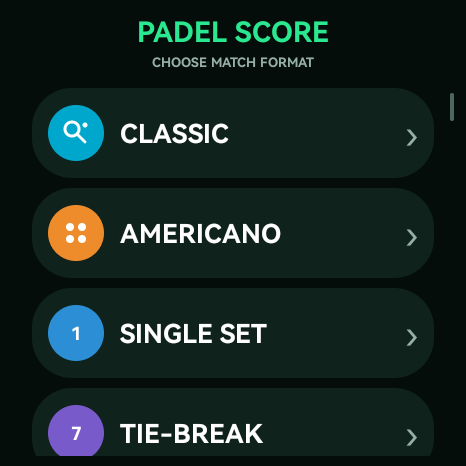
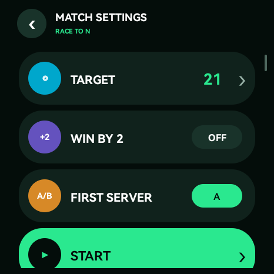
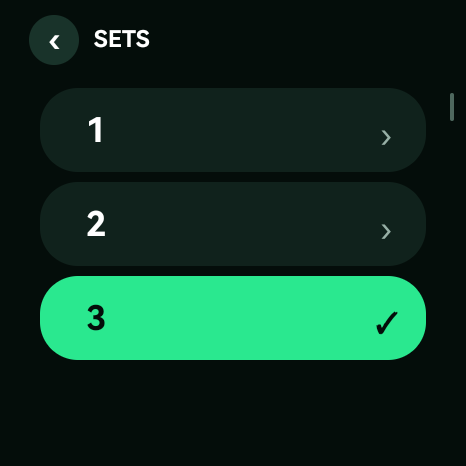
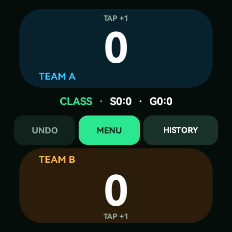
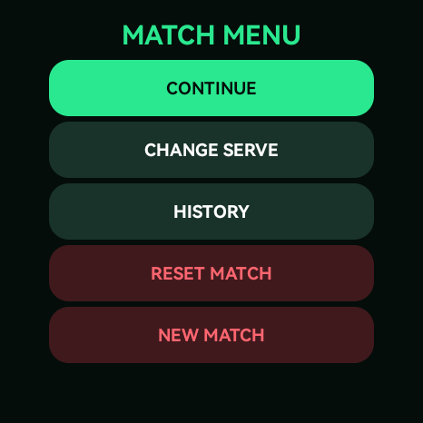

# Руководство пользователя PadelScore

PadelScore ведёт счёт матча прямо на часах без телефона и интернета. Интерфейс
рассчитан на быстрые нажатия во время игры: верхняя половина экрана относится к
команде A, нижняя — к команде B, а состояние матча сохраняется автоматически.

## Быстрый старт

1. Откройте `PadelScore` в списке приложений часов.
2. Прокрутите главный экран пальцем или колёсиком часов и выберите режим игры. Самые частые режимы
   `CLASSIC` и `AMERICANO` находятся в начале списка.
3. Проверьте параметры режима. Нажмите строку числового параметра и выберите
   значение из крупного списка; параметры `ON/OFF` меняются касанием строки.
4. Нажмите `START`.
5. Во время игры нажимайте большую область `TEAM A` или `TEAM B` после каждого
   выигранного очка.
6. Если очко добавлено ошибочно, сразу нажмите `UNDO`.

## Главный экран и режимы

| Пункт | Как считается матч | Когда использовать |
| --- | --- | --- |
| `CLASSIC` | Теннисный счёт 0–15–30–40, геймы и сеты | Обычный матч из нескольких сетов |
| `SINGLE SET` | Один сет с теннисным счётом | Короткий матч в один сет |
| `TIE-BREAK` | Очки 1, 2, 3… до заданной цели | Обычный тай-брейк, обычно до 7 |
| `SUPER TB` | Очки до заданной цели | Решающий супер-тай-брейк, обычно до 10 |
| `RACE TO N` | Побеждает первая команда, достигшая цели | Тренировка или матч с произвольным лимитом |
| `AMERICANO` | Разыгрывается ровно заданное общее число очков | Серия раундов Americano со сводной историей |

Если ранее начатый матч не завершён, на главном экране появляется
`RESUME MATCH`. После завершения доступна кнопка `VIEW LAST MATCH`. Она открывает
последнее сохранённое состояние; новый матч заменяет его только после нажатия
`START` на экране настроек.

## Настройка матча

Общие элементы экрана:

- стрелка `‹` — вернуться на предыдущий экран без запуска нового матча;
- строка со стрелкой `›` — открыть крупный прокручиваемый список значений;
- переключатель справа — включить или выключить параметр касанием строки;
- `START` — создать новый матч с выбранными параметрами.

Списки режимов, настроек и значений прокручиваются вертикальным движением
пальца или колёсиком часов. После свайпа список продолжает движение по инерции,
а дополнительное свободное место в конце позволяет поднять последний пункт к
центру экрана. Каждый пункт занимает одну крупную строку; цветная круглая иконка
слева помогает быстрее найти нужное действие.

Настройки каждого режима запоминаются отдельно и остаются выбранными при
следующем запуске приложения.

### Classic и Single Set

- `SETS` — сколько сетов нужно выиграть; доступно только в `CLASSIC`, от
  1 до 3. В `SINGLE SET` всегда играется один сет.
- `GAMES` — число геймов для победы в сете, от 1 до 12.
- `GOLDEN POINT` — при счёте 40:40 следующий розыгрыш сразу решает гейм. Если
  параметр выключен, используется преимущество (`AD`).
- `WIN SET BY 2` — без тай-брейка для победы в сете нужен перевес в два гейма.
- `TIE-BREAK` — при 6:6 запускается тай-брейк до 7 с перевесом в два очка. При
  включённом тай-брейке он завершает сет независимо от `WIN SET BY 2`.

Стандартные настройки `CLASSIC`: два выигранных сета, шесть геймов, обычное
преимущество, перевес в два гейма и тай-брейк при 6:6.

### Tie-break, Super TB и Race to N

- `TARGET` — целевой счёт. Нажмите строку и выберите одно из подготовленных
  значений: 7, 10, 15, 21, 24 или 32.
- `WIN BY 2` — матч продолжается после достижения цели, пока одна команда не
  получит перевес в два очка.
- `FIRST SERVER` — команда первой подачи: `A` или `B`.

Значения по умолчанию: `TIE-BREAK` — 7 с перевесом в два, `SUPER TB` — 10 с
перевесом в два, `RACE TO N` — 21 без обязательного перевеса.

### Americano

- `POINTS` — общее число розыгрышей в одном раунде; после достижения этой
  суммы раунд заканчивается, даже если счёт равный.
- `TRACK SERVE` — показывать и автоматически менять подающую команду.
- `SERVE EVERY` — через сколько разыгранных очков меняется подача, от 1 до 16.
- `FIRST SERVER` — первая подающая команда: `A` или `B`.

Стандартный раунд: 24 очка, учёт подачи включён, подача меняется каждые четыре
очка.

## Экран матча

| Область или кнопка | Действие |
| --- | --- |
| Большая верхняя зона `TEAM A` | Добавить очко команде A |
| Большая нижняя зона `TEAM B` | Добавить очко команде B |
| Цветная плашка `SERVE` | Показывает текущую подающую команду |
| Центральный статус | Одной крупной строкой показывает сокращённый режим и состояние матча: `CLASS · S0:0 · G2:1`, `AM32 · R1 · 10 LEFT` или `TB7 · 3 LEFT` |
| `UNDO` | Отменить последнее действие; можно нажимать несколько раз |
| `MENU` | Открыть меню управления матчем |
| `SERVE` | Вручную передать подачу другой команде |
| `HISTORY` | Открыть историю раундов Americano |
| `NEXT` | После завершения Americano начать следующий раунд |

`UNDO` отменяет не только очки, но и ручную смену подачи или завершение матча.
После завершения новые очки не добавляются, пока не начат новый матч/раунд или
не выполнена отмена. Очень быстрые повторные касания короче примерно 350 мс
фильтруются, чтобы случайный двойной тап не добавил два очка.

Счёт показан самым крупным шрифтом на экране. Надпись `TAP +1` напоминает, что
вся цветная карточка команды является кнопкой. После принятого очка карточка
кратко подсвечивается и показывает `+1 ADDED`; вибрация подтверждает действие.

В центральной строке используются короткие обозначения: `CLASS` — классический
матч, `1SET` — один сет, `TB` — тай-брейк, `STB` — супер-тай-брейк, `RACE` —
Race to N, `AM` — Americano, `S` — сеты, `G` — геймы, `R` — номер раунда.
После завершения эта же строка крупно показывает результат, например
`CLASS · A WINS` или `AM32 · DRAW`.

Во время активного матча приложение удерживает экран включённым. Если часы всё
же заблокировались по системному тайм-ауту, разблокируйте их: текущий счёт уже
сохранён.

## Меню матча

| Пункт меню | Что делает |
| --- | --- |
| `CONTINUE` | Закрывает меню и возвращает к счёту |
| `CHANGE SERVE` | Меняет подающую команду; действие можно отменить через `UNDO` |
| `HISTORY` | Показывает итоги текущей сессии Americano и последние раунды |
| `RESET MATCH` | После подтверждения сбрасывает счёт текущего матча/раунда |
| `NEW MATCH` | После подтверждения возвращает к выбору режима |

`RESET MATCH` в режиме Americano очищает только текущий раунд и сохраняет уже
завершённые раунды и суммарный счёт сессии. Чтобы удалить всю сессию Americano,
откройте `HISTORY`, нажмите `CLEAR` и подтвердите действие.

`NEW MATCH` не стирает сохранённый матч немедленно. Пока новый матч не запущен
кнопкой `START`, к прежнему можно вернуться через `RESUME MATCH` или
`VIEW LAST MATCH`.

## История Americano и следующий раунд

После окончания раунда справа появляется `NEXT ROUND`. Она сохраняет итог
раунда, увеличивает его номер и начинает следующий со счёта 0:0 и исходной
подающей командой.

На экране `HISTORY` показаны:

- суммарные очки команд A и B за сессию;
- до пяти последних завершённых раундов;
- `BACK` для возврата;
- `CLEAR` для полного удаления истории и сброса текущей сессии после
  подтверждения.

Если `TRACK SERVE` выключен, на экране матча вместо быстрой кнопки смены подачи
показывается `HISTORY`; смена подачи всё равно доступна через `MENU`.

## Возврат и восстановление

- На вложенном экране проведите пальцем слева направо, начиная в левой половине
  экрана. PadelScore вернётся на один уровень и коротко завибрирует.
- Компактная стрелка `‹` во вложенных экранах закреплена в верхней безопасной
  области круглого дисплея и выполняет то же действие.
- С главного экрана системная кнопка «Назад» закрывает приложение.
- Из настроек «Назад» возвращает на главный экран.
- Из меню или истории «Назад» возвращает к матчу.
- При выходе из начатого матча приложение просит подтверждение и сообщает, что
  матч останется сохранённым.
- Счёт, параметры, история Americano и цепочка `UNDO` сохраняются после каждого
  действия и при сворачивании приложения.

После перезапуска откройте приложение и нажмите `RESUME MATCH`. Если показан
последний завершённый матч, используйте `VIEW LAST MATCH`; для новой игры
выберите режим и нажмите `START`.

## Короткая шпаргалка

- Очко A — нажать верхнюю половину экрана.
- Очко B — нажать нижнюю половину экрана.
- Ошибка — `UNDO`.
- Неверная подача — `SERVE`.
- Обнулить только текущий матч/раунд — `MENU` → `RESET MATCH`.
- Полностью очистить Americano — `MENU` → `HISTORY` → `CLEAR`.
- Продолжить после перезапуска — `RESUME MATCH`.
- Начать другой формат — `MENU` → `NEW MATCH`, выбрать режим, настроить и
  нажать `START`.
